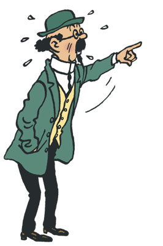
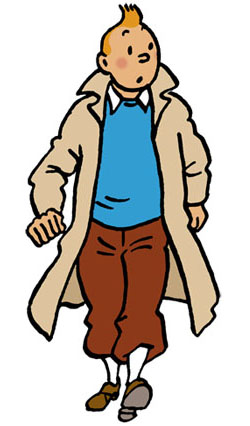
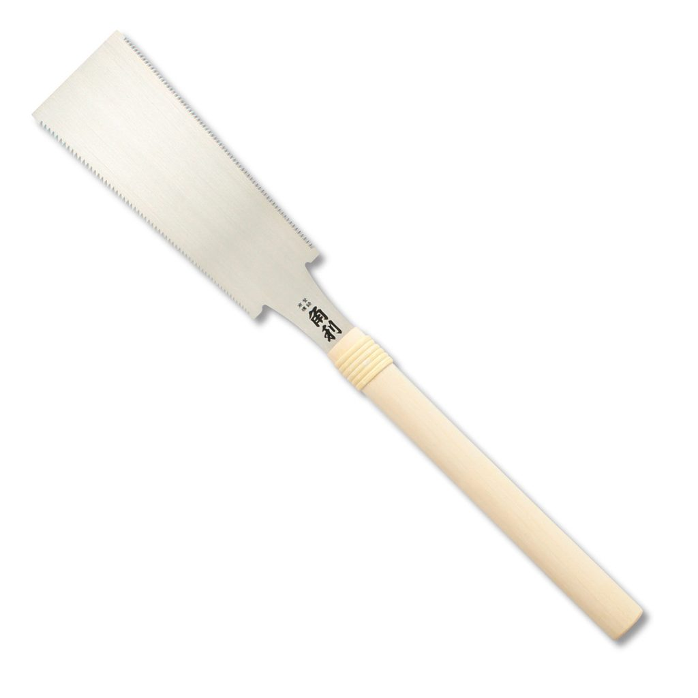

# Le point de grammaire 文法

----

## Le nom <ruby>名詞<rt>めいし</rt></ruby>

Indicates *who* <ruby>誰<rt>だれ</rt></ruby> does an action or *who* is subject to an action

Je mange une **pomme**. <ruby>私は林檎を食べます。<rt>わたしはりんごをたべます。</rt></ruby>

Je suis content. <ruby>私は嬉しいです。<rt>わたしはうれしいです。</rt></ruby> No noun !

## Les noms propres

There are two types of nouns:

> - Les noms propres　<ruby>固有名詞<rt>こゆうめいし</rt></ruby> (人、所、生き物の名前)
> - Les noms communs <ruby>普通名詞<rt>ふつうめいし</rt></ruby>

Paris, Londres, Jean, une pomme, un fil, Titi le chat, M.Katsu, le professeur Tournesol*

----

----

----

<iframe width="560" height="315" src="https://www.youtube.com/embed/XzkJI7oGcng" frameborder="0" allow="accelerometer; autoplay; encrypted-media; gyroscope; picture-in-picture" allowfullscreen></iframe>

----

<iframe width="560" height="315" src="https://www.youtube.com/embed/OLL1pEcBT4k" frameborder="0" allow="accelerometer; autoplay; encrypted-media; gyroscope; picture-in-picture" allowfullscreen></iframe>

----

## Le genre des noms

There are **two** genders for words:

- le masculin
- le féminin

## Les règles

It depends on the gender of the person referenced by the word.

It depends on the gender of the persons doing this type of work.

## Les suffixes <ruby>接尾辞<rt>せつびじ</rt></ruby> masculins

-age, -ail, -ament, -ement, -ier, -illon, -in, -is, -isme, -oir, -teur

**Exemples :** un orage, un portail, un firmament, un aboiement, un prunier, un oisillon, un plein, un pis, ***une*** vis, un sophisme, un trottoir, un tracteur

<ruby>嵐<rt>あらし</rt>, 門<rt>もん</rt>, 大空<rt>おおぞら</rt>, 吠える<rt>ほえる</rt>, 寒梅<rt>かんばい</rt>, 雛<rt>ひよこ</rt>,満タン<rt>まんタン</rt>, 牛<rt>うし</rt>の<rt> </rt>乳房<rt>ちぶさ</rt>, 螺子<rt>ねじ</rt>, 詭弁<rt>きべん</rt>, 歩道<rt>ほどう</rt>, トラクター</ruby>

## Les suffixes <ruby>接尾辞<rt>せつびじ</rt></ruby> féminins

-ade, -aie, -aille, -aine, -aison, -ance, -ande, -ée, -ie

**Exemples :** une salade, **un malade**, une haie, une paille, une plaine, une maison, une chance, une amande, une fée, une scie*

<ruby>サラダ, 患者<rt>かんじゃ</rt>, 垣根<rt>かきね</rt>, ストロー, 平野<rt>へいや</rt>, 家<rt>いえ</rt>, 勝ち目<rt>かちめ</rt>, アーモンド, 妖精<rt>ようせい</rt>, 鋸<rt>のこぎり</rt></ruby>

----

----

----

## Les suffixes <ruby>接尾辞<rt>せつびじ</rt></ruby> féminins

-ille, -ise, -ison, -itude, -oire, -té, -tion, -trice, -ure

**Exemples :** une famille, une surprise, une prison, une habitude, une poire, une volonté, une répétition, une institutrice, une coupure

<ruby>家族<rt>かぞく</rt>, 驚き<rt>おどろき</rt>, 刑務所<rt>けいむしょ</rt>, 習慣<rt>しゅうかん</rt>, 梨<rt>なし</rt>, 意志<rt>いし</rt>, 繰り返し<rt>くりかえし</rt>, 小学校<rt>しょうがっこう</rt>先生<rt>せんせい</rt>, 傷<rt>きず</rt></ruby>

----

# Se présenter

----

----

Bonjour.  
— Bonjour. Moi, je m'appelle Pierre et toi?  
— Moi, je suis Christophe. Ça va?  
— Oui, merci, ça va bien. Et toi?  
— Moi, aussi, merci.  
— À bientôt.  
— À bientôt.  

> - Imaginez votre identité et jouez le dialogue.

----

## 2. Cochez la bonne réponse. 

a. Je *t'/m'* apppelle. 
b. *Moi/Toi*, je suis Paul. 
c. J'habite à Paris et *moi/toi*? 
d. Je parle *France/français*.

----

## 3. Associez la colonne gauche avec la colonne droite.

| A | B |
|---|---|
| a. A bien | 1. elle |
| b. Mer | 2. va |
| c. Ça | 3. ci |
| d. Bon | 4. tôt |
| e. Je m'app | 5. jour |

----

## 4. Complétez le texte avec:

***parle - appelle — habite - suis***

> Bonjour, je m'_______ Marie-Claire. Je suis française et je _______ anglais et espagnol aussi...  
> J' _______ à Bordeaux. Je _______ professeur de français. Et toi?

# 来てくれてありがとう

----

Merci d'être venu aujourd'hui !

