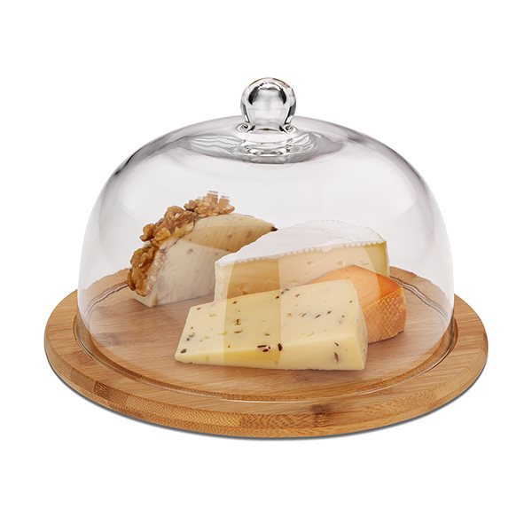

# Dictée - Verbes du 1^er^ groupe

## Bonne chance

## Correction

- Je suis japonais.
- Tu marches vite.
- Il ne parle pas chinois.
- Nous avons deux chiens
- Aimez-vous les pommes
- Elles se lèvent tous les matins à 08h

# Proverbe

## Une chose pas normale

> Quelque chose cloche 🔔

## Un objet de la cuisine

## Une version d'une histoire

> Qui n'entend qu'une cloche n'entend qu'un son

# Dialogue : À l'aéroport

- Avez-vous un appareil photo ?
- Oui, j'**en** ai **un**.
- Où est-il ?
- Il est **dans** ma valise.
- Qu'y a-t-il **dans** votre valise ?
- Il y a des vêtements et des livres.

---

- Il y a des vêtements et des livres.
- C'est tout ?
- Oui, c'est tout.
- De l'alcool ?
- Je n'**en** ai pas.
- Bon, ça va.

# Grammaire

## Les adverbes de lieu

- à côté <ruby>隣<rt>となり</rt>・<rt> </rt>横<rt>よこ</rt></ruby>
- à droite <ruby>右<rt>みぎ</rt></ruby>- à gauche <ruby>左<rt>ひだり</rt></ruby>
- ailleurs <ruby>他の場所<rt>ほかのばしょ</rt></ruby>
- à l'intérieur <ruby>内<rt>ない</rt></ruby>
- dedans <ruby>中<rt>なか</rt></ruby>
- à l'extérieur <ruby>外<rt>そと</rt></ruby>
- dehors <ruby>外<rt>そと</rt></ruby>

---

- derrière <ruby>後ろ<rt>うしろ</rt></ruby>
- devant <ruby>前<rt>まえ</rt></ruby>
- dessous <ruby>下<rt>した</rt></ruby>
- dessus <ruby>上<rt>うえ</rt></ruby>
- en bas <ruby>下<rt>した</rt></ruby>
- en face <ruby>前<rt>まえ</rt></ruby>
- en haut <ruby>上<rt>うえ</rt></ruby>

---

- ici <ruby>ここ</ruby>
- là <ruby>そこ</ruby>
- là-bas <ruby>あそこ</ruby>
- loin <ruby>遠く<rt>とうく</rt></ruby>
- près <ruby>近くに<rt>ちかくに</rt></ruby>

---

- nulle part <ruby>何処にも<rt>どこにも</rt></ruby>
- partout <ruby>其処ら<rt>そこら</rt></ruby>
- quelque part <ruby>何処か<rt>どこか</rt></ruby>
- tout droit <ruby>真っ直ぐ<rt>まっすぐ</rt></ruby>

## Les pronoms <ruby>代名詞<rt>だいめいし</rt></ruby> "en" et "y"

### En

- Remplaces a noun preceded by "de" or "du" (**uncountable noun**)

In English, **much** is used for **uncountable nouns** such as water, snow, bread and *many* for *countable nouns*.

---

> Je veux de l'eau.  
> <ruby>水が欲しい。<rt>みずがほしい</rt></ruby>
> J'**en** veux aussi.
> = Je veux aussi *de l'eau*.
> <ruby>私<rt>わたし</rt></ruby><ruby>も<rt> </rt></ruby><ruby>水<rt>みず</rt></ruby><ruby>が<rt> </rt></ruby><ruby>欲<rt>ほ</rt></ruby><ruby>しいです。<rt> </rt></ruby>

---

> Vous avez envie de chocolat ?  
> Oui, nous **en** avons envie  
> = Oui, nous avons envie *de chocolat*.

---

### Attention ! 注意[ちゅうい]

It should only be used **for objects, not people**.

> Vous parlez du patron ?  
> <ruby>あなた<rt> </rt></ruby><ruby>達<rt>たち</rt></ruby><ruby>大統領<rt>だいとうりょう</rt></ruby><ruby>について<rt> </rt></ruby><ruby>話<rt>はなし</rt></ruby><ruby>しますか？</ruby>  
> Oui, nous parlons de lui.  
>  <ruby>はい、<rt> </rt></ruby><ruby>私達<rt>わたしたち</rt></ruby><ruby>は<rt> </rt></ruby><ruby>彼<rt>かれ</rt></ruby><ruby>について<rt> </rt></ruby><ruby>話<rt>はなし</rt></ruby>します。</rt></ruby>

---

- It is used with a quantity of something (**countable noun**)

> - Je fais les courses. Est-ce qu’il reste du lait ?
> - Non, il n’**en** reste plus.
> - Et de la farine ?
> - Oui, il est **en** reste **un** paquet.
> - Et des œufs ?
> - Oui, il **en** reste **cinq**.

---

> - Et de l’eau ?
> - Non, il n’**en** reste plus.
> - Est-ce que tu as acheté une poêle hier ?
> - Oui, j’**en** ai acheté **une** pour faire les crêpes.

---

### Y

- To replace a noun preceded by "à" or "au"

Some verbs are always folowed by "à" : penser à (to think of), s'intéresser à (to be interested in), réfléchir à (to reflect upon), participer à (to take part in), croire à (to believe in), jouer à (to play) etc.

---

> - Est-ce que vous participerez **au tournoi de football** dimanche?
> - Oui, bien sûr, nous **y** participerons et nous gagnerons!

> - Est-ce que vous vous intéressez à **l'art moderne**?
> - Non, nous ne nous **y** intéressons pas du tout!

---

- To replace the name of a location/place

> - Tu pars où pendant les vacances?
> - Je pars **en Australie**.
> - Et tu **y** vas à quelle période?
> - J'**y** vais à Noël. Et toi, tu vas où?
> - Moi, je vais **aux Etats-Unis**!
> - C'est super! Tu **y** vas avec qui?
> - J'**y** vais avec ma famille.

---

### Exercice y = ?

> - Quand vas-tu à la banque ?
> - J'y vais ce matin.

> - Avec qui vas-tu au cinéma ?
> - J'y vais avec mes amis.

> - Pourquoi vas-tu à l'aéroport ?
> - J'y vais pour aller chercher mes parents qui reviennent de vacances.

---

> - Comment vas-tu aux Halles ?
> - J'y vais en métro.

> - Comment pars-tu en Corse ?
> - J'y vais en bateau.

> - Quand vas-tu à Cuba ?
> - J'y vais en décembre.

## Les adjectifs démonstratifs この、その、あの

| Adjectif | Mot suivant                                     | Exemple     |
| -------- | ----------------------------------------------- | ----------- |
| Ce       | + Nom masculin                                  | Ce chien    |
| Cet      | + Nom masculin  (commençant par une voyelle) | Cet arbre   |
| Cette    | + Nom féminin                                   | Cette fille |
| Ces      | + Nom pluriel                                   | Ces maisons |

---

We separate between a close object (**« -ci »**), and a far one (**« -là »**)

ici / là, ceci / celà, ce jour-ci / ce jour-là, voici / voilà, par ici / par là

# Vocabulaire

## Les jours de la semaine

- Lundi <ruby>月曜日<rt>げつようび</rt></ruby>
- Mardi <ruby>火曜日<rt>かようび</rt></ruby>
- Mercredi <ruby>水曜日<rt>すいようび</rt></ruby>
- Jeudi <ruby>木曜日<rt>もくようび</rt></ruby>
- Vendredi <ruby>金曜日<rt>きんようび</rt></ruby>
- Samedi <ruby>土曜日<rt>どようび</rt></ruby>
- Dimanche <ruby>日曜日<rt>にちようび</rt></ruby>

---

- Un jour <ruby>一日<rt>いちにち</rt></ruby>
- Une semaine <ruby>一週間<rt>いっしゅうかん</rt></ruby>
- Le matin <ruby>午前<rt>ごぜん</rt>・<rt></rt>朝<rt>あさ</rt></ruby>
- L'après-midi <ruby>午後<rt>ごご</rt></ruby>
- L'école <ruby>学校<rt>がっこう</rt></ruby>
- La maison <ruby>家<rt>いえ</rt></ruby>

---

- Cet après midi <ruby>今日<rt>きょう</rt>の<rt></rt>午後<rt>ごご</rt></ruby>
- Ce matin <ruby>今日<rt>きょう</rt><ruby>の<rt></rt>午前<rt>ごぜん</rt></ruby>
- Ce soir <ruby>今晩<rt>こんばん</rt></ruby>
- La semaine prochaine <ruby>来週<rt>らいしゅう</rt></ruby>
- La semaine dernière <ruby>先週<rt>せんしゅう</rt></ruby>

---

- Demain <ruby>明日<rt>あした</rt></ruby>
- Après-demain <ruby>明後日<rt>あさって</rt></ruby>
- Après-après demain (spoken language only) <ruby>二日後<rt>ふつかご</rt></ruby>   = Dans deux jours
- Hier <ruby>昨日<rt>きのう</rt></ruby>
- Avant-hier <ruby>一昨日<rt>おととい</rt></ruby>

# Culture

## Un journal français

# 来てくれてありがとう

---

